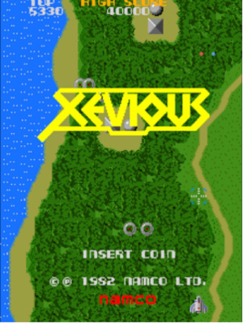

Xevious core for the MEGA65 R6
==============================

MEGA65 R6 port of Xevious arcade game based on

* XeviousMEGA65 R3 port https://github.com/sho3string/XeviousMEGA65 by sho3string
* MiSTer2MEGA65 https://github.com/sy2002/MiSTer2MEGA65.git by sy2002
* Arcade-Xevious_MiSTer port https://github.com/sho3string/Arcade-Xevious_MiSTer by sho3string

This is just a mere attempt to understand HDL domain, things may not work entirely as expected :-) 
Fixes to possible bugs and/or improvements will be added as soon as possible.

ISSUES: 
    - flipping joystick port shows that port 2 is not working, it has been escalated to the authors/maintainers of M2M

Bitstream can be generated using Vivado (eg. 2024.1) and core from it by using bit2core or coretool utility for MEGA65. 
For installation details refer to the original R3 port.
It has been tested against xevious.zip, with the following content of SD card (/arcade/xevious):

| file        | size  |
| ------------|-------|
| 50xx.bin    | 2048  |
| 51xx.bin    | 1024  |
| 54xx.bin    | 1024  |
| rom1.rom    | 16384 | 
| rom2.rom    | 8192  |
| xevcfg      | 99    |
| xvi_10.2b   | 8192  |
| xvi_11.2c   | 4096  |
| xvi_12.3b   | 4096  |
| xvi_13.3c   | 4096  |
| xvi_14.3d   | 4096  |
| xvi_15.4m   | 8192  |
| xvi_16.4n   | 4096  |
| xvi_17.4p   | 8192  |
| xvi_18.4r_1 | 4096  |
| xvi_18.4r_2 | 4096  |
| xvi_7.2c    | 4096  |
| xvi_9.2a    | 4096  |

In case of problems with display, try different resolutions and/or ports (HDMI/VGA).

Enjoy!
