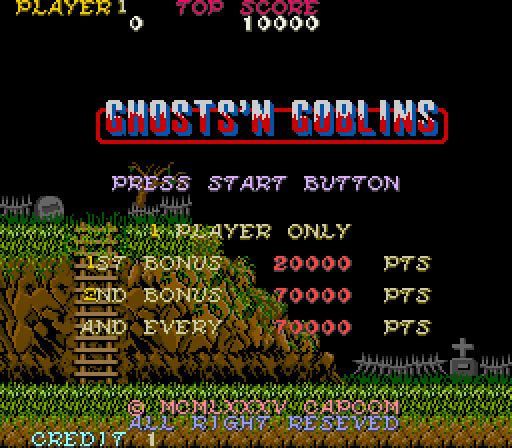

GnG core for the MEGA65 R6
==========================

MEGA65 R6 port of Ghosts'n Goblins arcade game based on

* MEGA65 R3 port https://github.com/sho3string/GnGMEGA65.git done by sho3string
* MiSTer2MEGA65 https://github.com/sy2002/MiSTer2MEGA65.git done by sy2002
* Arcade-GnG_MiSTer https://github.com/sho3string/Arcade-GnG_MiSTer.git done by sho3string

This is just a mere attempt to understand HDL domain and port one of my favourite arcade game to the MEGA65 R6. 
It might not work entirely as expected :-) Fixes to possible bugs and/or improvements will be added as soon as possible.

Bitstream can be generated using Vivado (eg. 2024.1) and core from it by using bit2core or coretool utility for MEGA65. For installation details (placing GnG roms on the SD card, etc) refer to: https://github.com/sho3string/GnGMEGA65/blob/master/README.md.

Enjoy!